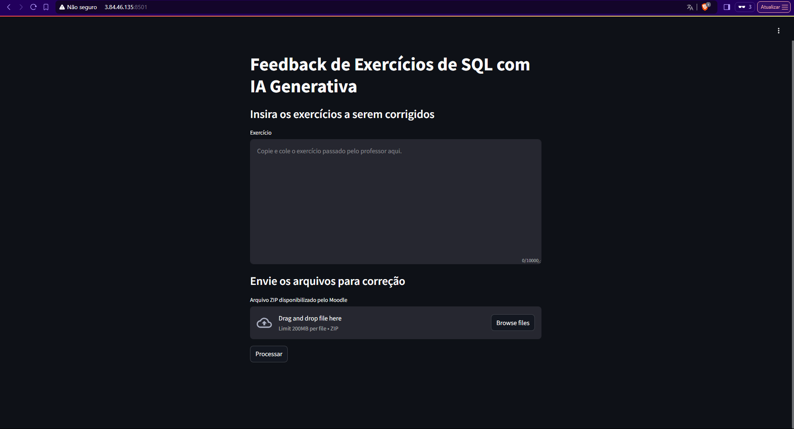
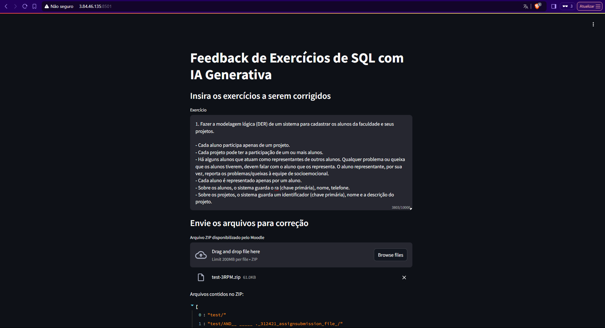
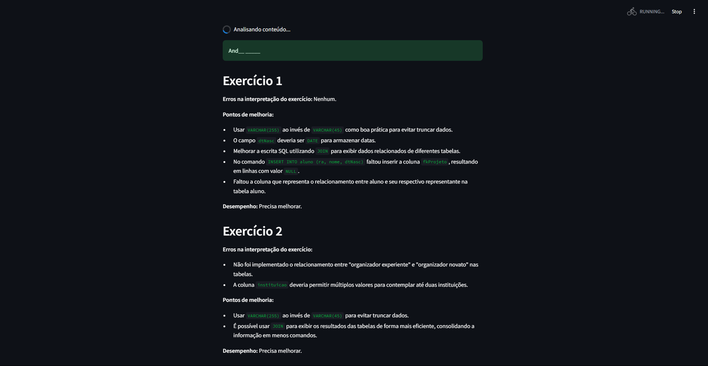

# DB Professor AI

**DB Professor AI** tem como objetivo fornecer feedbacks automatizados e detalhados para alunos que enviam exercícios de banco de dados MySQL. Utilizando Python, a API do Google Gemini e a biblioteca Streamlit, o sistema é capaz de analisar scripts SQL contidos em arquivos ZIP, garantindo um suporte técnico eficiente e direto. Tendo como objetivo aprimorar a rapidez e eficiência de feedback aos alunos.

## Funcionalidades

- Interação em Linguagem Natural: O sistema permite que os usuários façam perguntas ou instruções em linguagem natural, que são automaticamente convertidas em consultas SQL.
- Consultas Otimizadas: A IA gera consultas SQL otimizadas com base nas instruções fornecidas, facilitando o acesso aos dados sem a necessidade de profundo conhecimento técnico.

## Screenshots




## Tecnologias utilizadas

- Python.
- Google Generative AI.


## Estrutura do Projeto

```bash
insight-ia/
│
├── app/
│   ├── __init__.py               # Arquivo de inicialização do pacote `app`
│   ├── main.py                   # Arquivo principal que inicializa a aplicação Streamlit
│   ├── interface/
│   │   ├── __init__.py           # Arquivo de inicialização do subpacote `interface`
│   │   └── layout.py             # Definições da interface com Streamlit
│   ├── services/
│   │   ├── __init__.py           # Arquivo de inicialização do subpacote `services`
│   │   └── ai_generator.py       # Integração com o CodeLlama e geração de queries
│   └── utils/
│       ├── __init__.py           # Arquivo de inicialização do subpacote `utils`
│       ├── files.py              # Funções de leitura de arquivos
│       └── student.py            # Classe com o objeto de estudante
│
├── requirements.txt              # Lista de dependências do projeto
├── .env                          # Arquivo de variáveis ambientes
├── README.md                     # Documentação do projeto
├── .gitignore                    # Arquivos e pastas a serem ignorados pelo Git
└── setup.py                      # Script para configuração e instalação do projeto
```
    
## Como Utilizar

- Python instalado

- Configurar projeto:
```bash
python setup.py
```

- Iniciar projeto:
```bash
source venv/Scripts/activate
streamlit run app/main.py
```

## Variáveis de Ambiente

Para rodar este projeto, adicione as seguintes variáveis de ambiente no seu arquivo .env:

`GEMINI_API_KEY={API_KEY}`

`MODEL_NAME=gemini-1.5-pro`

`RPM=2`

`SECURITY_WAIT=5`


## Autores

- [@KauanCavazani](https://www.github.com/KauanCavazani)
- [@leovasc5](https://www.github.com/leovasc5)

